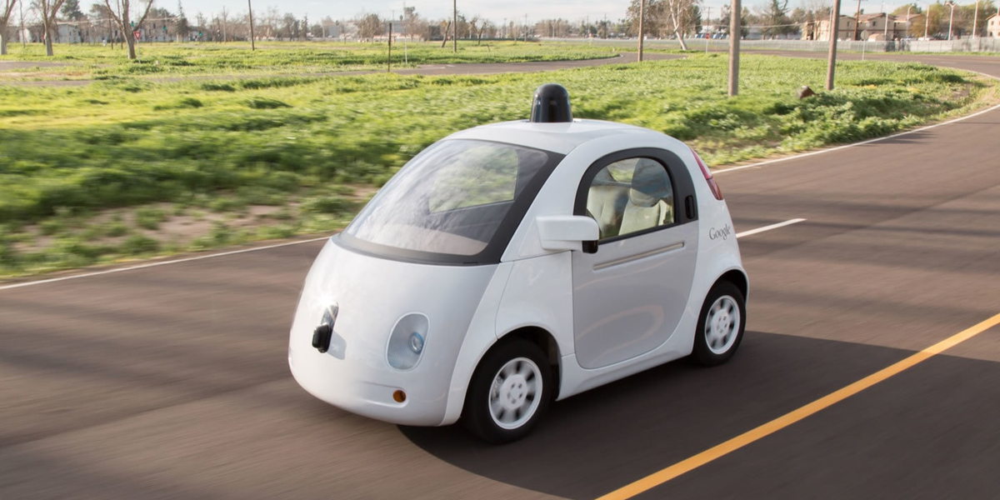
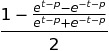
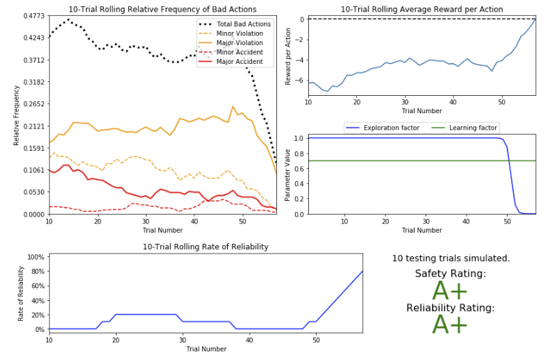

# Application of Reinforcement Learning on Autonomous Driving Agents

-----

## Scope

In this project, we work towards constructing an optimized Q-Learning driving agent that navigates a *Smartcab* through its environment towards a goal. Since the *Smartcab* is expected to drive passengers from one location to another, the driving agent is evaluated on two fundamental metrics: **Safety** and **Reliability**. A driving agent that gets the *Smartcab* to its destination while running red lights or narrowly avoiding accidents would be considered **unsafe**. Similarly, a driving agent that frequently fails to reach the destination in time would be considered **unreliable**. Maximizing the driving agent's **safety** and **reliability** would ensure that *Smartcabs* have a permanent place in the transportation industry.

**Safety** and **Reliability** are measured using a letter-grade system as follows:

| Grade 	| Safety 	| Reliability 	|
|:-----:	|:------:	|:-----------:	|
|   A+  	|  Agent commits no traffic violations, and always chooses the correct action. | Agent reaches the destination in time for 100% of trips. |
|   A   	|  Agent commits few minor traffic violations, such as failing to move on a green light. | Agent reaches the destination on time for at least 90% of trips. |
|   B   	| Agent commits frequent minor traffic violations, such as failing to move on a green light. | Agent reaches the destination on time for at least 80% of trips. |
|   C   	|  Agent commits at least one major traffic violation,  such as driving through a red light. | Agent reaches the destination on time for at least 70% of trips. |
|   D   	| Agent causes at least one minor accident,  such as turning left on green with oncoming traffic.       	| Agent reaches the destination on time for at least 60% of trips. |
|   F   	|  Agent causes at least one major accident, such as driving through a red light with cross-traffic.      	| Agent fails to reach the destination on time for at least 60% of trips. |

-----

## Results

The decay function we created was inspired by the sigmoid function. Our goal was to create a function that during learning allow the agent to explore all possible actions in order to populate a Q-table with as many actions as possible. Then drop quickly the Exploration Factor before start testing to use the gathered knowledge.  

This function is:  

where 'p' is a parameter that adjust the position of the function on the X axis, thus adjusts the number of trials that will be used for training. We were be able to achieve top rated score for p=50.  

An interesting observation is how quick the agent learns. With the suggested decay function the agent needs less than 60 trials before beginning testing.

Trying different parameters we achieved the best results with a learning rate of 0.7. For the epsilon-tolerance, we had to use a tiny number (0.00001) since the Exploration Factor was converging very fast to 0.  

-----

#### Notes
- Adapted from a reinforcement learning assignement during my study for Udacity's [Machine Learning Engineer NanoDegree](https://www.udacity.com/course/machine-learning-engineer-nanodegree--nd009t)  
- Template code provided by Udacity and can be found on [this](https://github.com/udacity/machine-learning/tree/master/projects/smartcab) GitHub repository.
